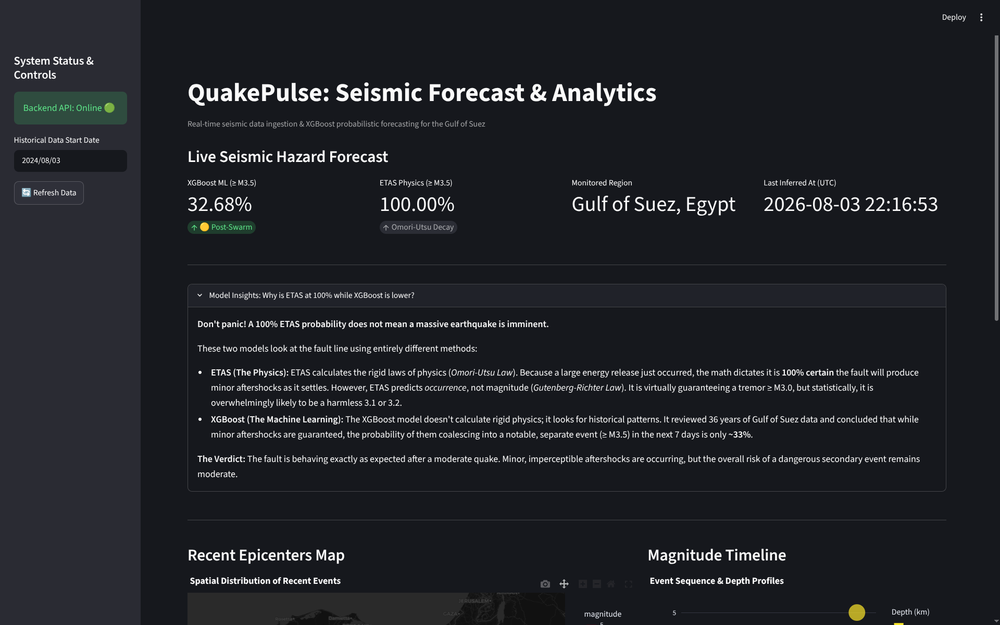
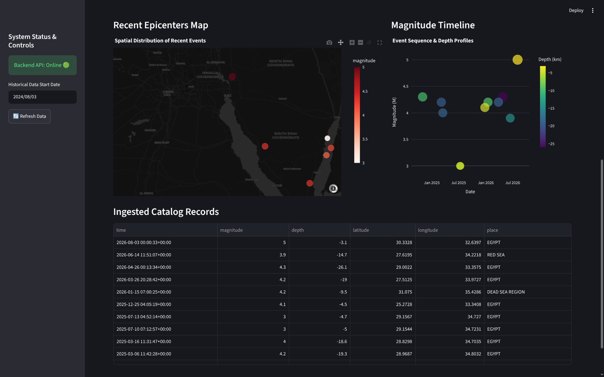

# 🌋QuakePulse: Seismic Forecast Following MLOps Pipeline

_following the earthquake that woke me up at 3 am, my mind was shaken enough to make this project in one day, so here we are, enjoy it!_

**QuakePulse** is an MLOps application that ingests, processes, and forecasts seismic hazard probabilities for the **Gulf of Suez, Egypt**.



The project bridges empirical **Machine Learning** with deterministic **Geophysical Physics**, wrapped in a high-performance FastAPI backend, an interactive Streamlit dashboard, and fully containerized via Docker Compose for seamless deployment.



## Architectural Highlights & MLOps Focus

QuakePulse was built with a strong emphasis on modern MLOps practices:

- **Dual-Model Ensemble Architecture:**
    
    - **XGBoost Classifier (ML):** Evaluates 36 years of historical seismic records and rolling energy features to predict the statistical probability of a notable seismic event ($\ge$ M3.5) within a 7-day window.
        
    - **Temporal ETAS (Physics):** Implements a raw NumPy-vectorized mathematical model of the **Omori-Utsu Law** to calculate the physical aftershock decay rate following recent tectonic energy spikes.
        
- **High-Performance Backend:** Built with **FastAPI**, **SQLAlchemy**, and asynchronous patterns, providing robust API endpoints and automated schema validation via Pydantic.
    
- **Modern Python Tooling:** Built and managed entirely using **`uv`** for lightning-fast dependency resolution, reproducible environments, and strict lockfile compliance (`uv.lock`).
    
- **Production-Ready Containerization:** Multi-container orchestration via **Docker & Docker Compose** with isolated networking, bytecode compilation, volume persistence, and optimized multi-stage build processes.
    
- **Zero-Friction "Clone & Run":** Ships with a pre-seeded SQLite database (`Hezny.db`) and baked model artifacts (`model.json`), enabling instant out-of-the-box evaluation without external database setup.
    

## System Architecture


``` ASCII
       [ USGS / Seismological Feed ]
                    │ (Automated Ingestion)
                    ▼
           [ FastAPI Backend ] ◄────► [ SQLite DB (Hezny.db) ]
            /               \
           / (Inference)     \ (Physics Rate)
          ▼                   ▼
    [ XGBoost Model ]   [ Temporal ETAS ]
          \                   /
           ▼                 ▼
         [ Streamlit UI & Plotly Dashboard ]
```

## Quick Start (Clone & Run)

Anyone can spin up the entire MLOps stack locally or on a remote server with a single command using Docker.

### Prerequisites

- [Docker](https://docs.docker.com/get-docker/) and Docker Compose installed on your machine.

### Installation Steps

1. **Clone the repository:**
    
    ``` bash
    git clone https://github.com/Losif01/QuakePulse
    cd QuakePulse
    ```
    
2. **Spin up the stack via Docker Compose:**

    
    ``` bash
    docker compose up -d --build
    ```
    
3. **Access the Application:**
    
    - **Streamlit Interactive Dashboard:** `http://localhost:8501`
        
    - **FastAPI Swagger Documentation:** `http://localhost:8000/docs`
        

## Local Development (Without Docker)

If you prefer to run the components locally using `uv`:

```bash
# 1. Install dependencies
uv sync

# 2. Start the FastAPI backend
uv run uvicorn app.main:app --reload --port 8000

# 3. In a separate terminal, launch the Streamlit UI
uv run streamlit run ui.py
```

## Project Structure

```
Hezny/ # its name on my machine, but you could stick with the boring "QuakePulse"
├── app/
│   ├── api/v1/endpoints/   # FastAPI route controllers (forecast, earthquakes)
│   ├── core/               # Database session and app configs
│   ├── db/                 # SQLAlchemy models and schemas
│   └── services/           # ML Engine (XGBoost) & ETAS Physics Engine
├── data/
│   ├── Hezny.db            # Pre-seeded historical earthquake database
│   └── model.json          # Exported XGBoost model artifact
├── docker-compose.yml      # Multi-container orchestration
├── Dockerfile              # Container build spec utilizing uv
├── pyproject.toml          # Project dependencies & configuration
├── ui.py                   # Streamlit front-end dashboard
└── uv.lock                 # Strict dependency lockfile
```
